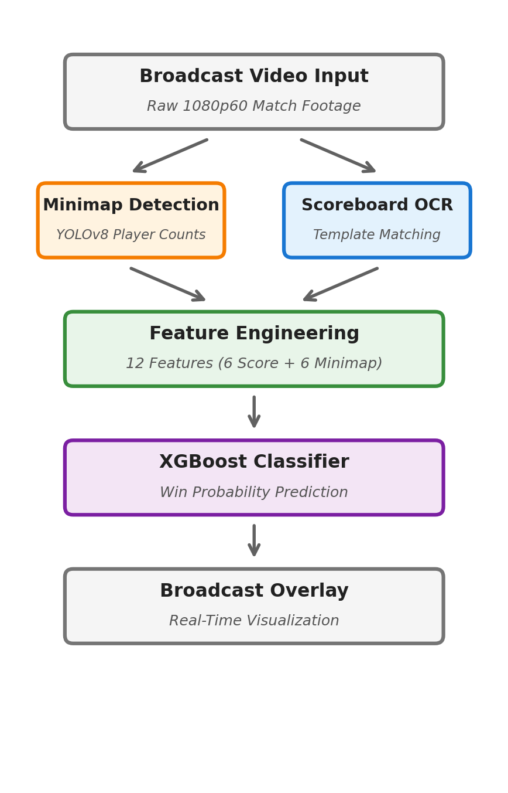
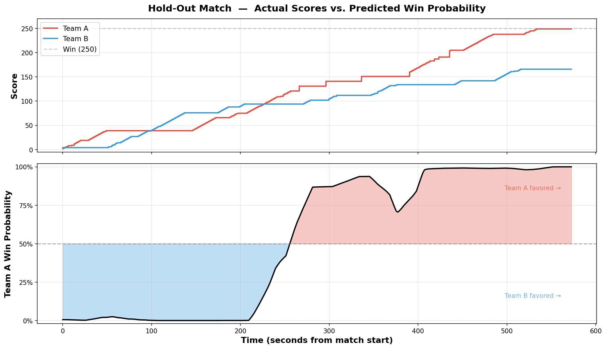

# Reading the Game: Real-Time Win Prediction from Broadcast Video

**Trevor Gregory** | College of Business and Computing, Regis University, Denver CO

An end-to-end computer vision pipeline that extracts real-time telemetry from Call of Duty League broadcast footage and predicts match win probability using machine learning.



---

## Project Overview

This system processes standard 1080p/60fps esports broadcast video through three stages to produce a live win probability overlay:

1. **Minimap Player Detection** -- A YOLOv8 object detection model identifies friendly and enemy players on the in-game minimap, providing spatial telemetry unavailable from the scoreboard alone.

2. **Scoreboard OCR via Template Matching** -- Custom template matching reads team scores and the game clock from the broadcast HUD. This approach replaced an earlier EasyOCR attempt that proved unreliable on the game's stylized font.

3. **Win Probability Model** -- An XGBoost classifier trained on 12 engineered features (6 scoreboard + 6 minimap telemetry) predicts the probability of each team winning at any point in the match. Mirror augmentation doubles the training data by swapping team perspectives.

## Key Results

| Metric | Value |
|--------|-------|
| Scoreboard field completeness | **99.3%** |
| Predictive power from minimap telemetry | **~43%** |
| Total frames processed | **111,360** |
| Augmented training rows | **154,080** |
| Video overlay frame rate | **59.94 fps** |

**Top features by importance:** `score_diff` (0.26), `player_alive_rolling` (0.16), `enemy_alive_rolling` (0.15), `advantage_rolling` (0.13)



## Repository Structure

```
esports_cv/
├── auto_label_pipeline.py          # Active learning: seed labels -> auto-label
├── extract_training_data.py        # Sample frames from video for labeling
├── organize_dataset.py             # Organize images into train/val splits
├── audit_dataset.py                # Dataset quality audit
├── clean_dataset.py                # Remove bad labels
├── train_production_model.py       # Train YOLOv8-Medium for minimap detection
│
├── extract_telemetry_csv.py        # v1: EasyOCR scoreboard extraction (replaced)
├── extract_telemetry_template_matching.py  # v2: Template matching extraction (final)
├── extract_templates_from_video.py # Extract digit templates from video
├── process_matches.py              # Batch process multiple match videos
│
├── train_win_probability.py        # v1: Single-match win probability model
├── validate_model.py               # v2: Hold-out validation
├── final_model_validation.py       # v3: 12-feature model with mirror augmentation
│
├── render_broadcast_ui.py          # Full-match broadcast overlay renderer
├── render_demo_clip.py             # 30-second demo clip renderer
├── visualize_inference.py          # Visualize YOLO detections on frames
├── generate_presentation.py        # PowerPoint slide generation
├── overlay_mockup.html             # UI overlay design exploration
│
├── check_mps.py                    # Apple Silicon MPS verification
├── get_reference_frame.py          # Extract reference minimap frame
├── view_reference.py               # View reference frame
│
├── requirements.txt                # Python dependencies
├── dataset.yaml                    # YOLO dataset configuration
├── week1_progress.md               # Week 1 development report
│
├── data/
│   ├── matches/                    # Clean match CSVs (3 Hardpoint matches)
│   ├── templates/                  # Digit templates for template matching
│   └── yolo_dataset/               # Training images + YOLO-format labels
│
├── runs/                           # YOLO training outputs (charts, metrics)
│   └── detect/
│       ├── val/                    # Validation curves, confusion matrices
│       └── runs/                   # Training run results
│
├── report/                         # LaTeX final report + figures
│
├── reference_map.jpg               # Game screenshot (minimap + scoreboard)
├── Pipeline_diagram.png            # Architecture diagram
├── final_validation_chart.png      # Primary result chart
├── win_probability_chart.png       # v1 win probability (early iteration)
├── win_probability_v2.png          # v2 win probability (early iteration)
└── demo_thumbnail.png              # Broadcast overlay screenshot
```

## Pipeline Execution

```bash
# 1. Setup
python check_mps.py                              # Verify GPU acceleration

# 2. Data Preparation (Active Learning)
python extract_training_data.py                   # Sample frames from video
python auto_label_pipeline.py                     # Seed label -> train -> auto-label
python organize_dataset.py                        # Train/val split
python audit_dataset.py                           # Quality check
python clean_dataset.py                           # Remove bad labels

# 3. YOLOv8 Model Training
python train_production_model.py                  # Train YOLOv8-Medium

# 4. Telemetry Extraction
python extract_templates_from_video.py            # Build digit templates
python extract_telemetry_template_matching.py     # Extract scores + timer
python process_matches.py                         # Batch process all matches

# 5. Win Probability Model
python final_model_validation.py                  # Train, validate, and chart

# 6. Presentation
python render_broadcast_ui.py                     # Full-match overlay video
python render_demo_clip.py                        # 30-second demo clip
python generate_presentation.py                   # PowerPoint deck
```

## Feature Set

| # | Category | Feature | Description |
|---|----------|---------|-------------|
| 1 | Scoreboard | `score_a` | Team A current score |
| 2 | Scoreboard | `score_b` | Team B current score |
| 3 | Scoreboard | `score_diff` | Score A minus Score B |
| 4 | Scoreboard | `score_rate_a` | Team A points per second |
| 5 | Scoreboard | `score_rate_b` | Team B points per second |
| 6 | Scoreboard | `time_remaining_fraction` | Match time remaining / total |
| 7 | Telemetry | `player_count_map` | Friendly players on minimap |
| 8 | Telemetry | `enemy_count_map` | Enemy players on minimap |
| 9 | Telemetry | `player_advantage` | Friendly minus enemy |
| 10 | Telemetry | `player_alive_rolling` | 30s rolling avg friendly |
| 11 | Telemetry | `enemy_alive_rolling` | 30s rolling avg enemy |
| 12 | Telemetry | `advantage_rolling` | 30s rolling avg advantage |

## Design Decisions

- **Template Matching over EasyOCR**: EasyOCR produced inconsistent results on the game's stylized numeric font. Template matching with normalized cross-correlation achieved 99.3% field completeness.
- **Mirror Augmentation**: With only 3 matches available, swapping the Team A/B perspectives doubles the training data and ensures balanced win/loss classes.
- **Rolling Averages**: Raw per-frame minimap counts are noisy due to respawn cycles. A 30-second rolling window captures sustained map control trends that predict scoring runs before they appear on the scoreboard.
- **Active Learning Annotation**: Instead of manually labeling 700+ frames, a seed set of 50 manual labels trained a weak YOLOv8-Nano model that auto-labeled the remainder, reducing annotation time by ~90%.

## Hardware

Developed on Apple Silicon with MPS (Metal Performance Shaders) acceleration for GPU-accelerated YOLOv8 training and inference.

## Author

Trevor Gregory
College of Business and Computing, Regis University
tgregory004@regis.edu

## Acknowledgments

Built with assistance from Claude (Anthropic) and Gemini (Google). See the final report for complete references.
